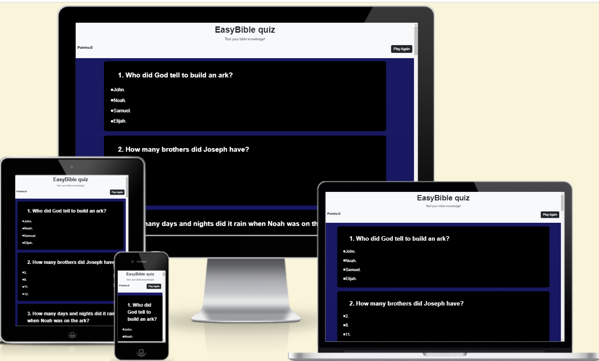

# EasyBible Quiz

Visit the deployed site: [EasyBible quiz](https://graciekan21.github.io/easybible/)

Test your bible knowledge!

As of my last knowledge update in January 2022, I don't have specific information about a particular Bible quiz web page's history. However, I can provide you with a general overview of the concept and the development of online Bible quizzes.

Online Bible quizzes have gained popularity as a way for individuals to test their knowledge of the Bible, learn more about its contents, and engage in a community of like-minded individuals. These quizzes often cover a wide range of topics, including biblical stories, characters, theology, and more.

[YouGov](https://today.yougov.com/topics/politics/explore/topic/The_Bible-Topic) show that 48% of people are round the world surveyed have heard of a Bible quiz, and are rated as the very influential.

Am inspired by various motivations,
Educational Purpose:

Promoting Bible Knowledge: A primary motivation is to encourage and facilitate the learning of the Bible. Quizzes can cover a range of topics from specific verses to general themes, helping individuals deepen their understanding of the scriptures.
Youth and Sunday School: Bible quizzes are often used as educational tools in youth groups, Sunday school classes, and other educational settings to make learning about the Bible more engaging for younger audiences.
Spiritual Growth:

Personal and Spiritual Development: Creating or participating in Bible quizzes can be a means for individuals to strengthen their faith, reflect on biblical teachings, and engage in personal spiritual growth.
Community Building:

Church Groups and Communities: Bible quizzes can serve as a fun and interactive way to bring members of a church community together. They provide a shared activity that promotes fellowship and discussion around biblical topics.
Online Ministry:

Reaching a Global Audience: With the rise of online platforms, individuals and organizations may create Bible quizzes as a way to reach a global audience, allowing people from different parts of the world to engage in discussions about the Bible, Many more.

- [GitHub last commit]

- [GitHub top language](Html-css-Javascript)

## CONTENTS

- [EasyBible Quiz](#easybible-quiz)
  - [CONTENTS](#contents)
  - [User Experience (UX)](#user-experience-ux)
    - [User Stories](#user-stories)
      - [First Time Visito- Goals](#first-time-visito--goals)
      - [Returning Visitor- Goals](#returning-visitor--goals)
      - [Frequent Visitor- Goals](#frequent-visitor--goals)
    - [Colour Scheme](#colour-scheme)
    - [Background linear-gradien](#background-linear-gradien)
    - [Features](#features)
      - [The Home Page](#the-home-page)
      - [The Future for the site](#the-future-for-the-site)
    - [Accessibility](#accessibility)
    - [Languages Used](#languages-used)
  - [Deployment \& Local Development](#deployment--local-development)
    - [Deployment](#deployment)
    - [Local Development](#local-development)
      - [How to Fork](#how-to-fork)
      - [How to Clone](#how-to-clone)
  - [Testing](#testing)
    - [Solved Bu gs](#solved-bu-gs)
    - [Kno-n Bugs](#kno-n-bugs)
  - [Credits](#credits)
    - [Code Used](#code-used)
    - [Content](#content)
    - [Media](#media)
    - [Acknowledgments](#acknowledgments)
  - [happycoding](#happycoding)

---

## User Experience (UX)

### User Stories

#### First Time Visito- Goals

- I want to take part in a bible quiz online to test my bible knowledge. I want to be able to do this any time, a-ywhere.
- I want the site to be responsive to my-device.
- I want the site to be easy to navigate.

#### Returning Visitor- Goals

- I want to be able to choose questions in levels from easy, hard and Hardest that thus making it more interactive and making me want to come back again.

#### Frequent Visitor- Goals

- I want to be able to add in a kids corn quiz, hard level and hardest level of question.
- I want to be able to add it social media platforms.

---

### Colour Scheme

 Am using  website

In my css file I have used variables to declare colours because it easy to make change color any time you want.

- I am using `rgb(255, 255, 255)`,`rgb(156, 158, 167)`,`#cbd2dc` & `white` colors for the background-linear-gradient image and text.
- I am using `black`,`rgba(50, 50, 50, 0.825)` for the border and questions display.
- I am using `rgb(1, 3, 3)` for the answer display.
- 1 am using `#fcf5f5` for answers when hovered over and for the `rgba(7, 10, 7, 0.3)` for answer display
- i am using `red` when answer is wrong and green when answer is correct.

 Google Fonts am using to import the fonts for using in the site.

- For the Page Title I am using the google font [Roboto](@import url('<https://fonts.googleapis.com/css2?family=Roboto:ital>,wght@0,500;1,400&display=swap');
Roboto has a dual nature. It has a mechanical skeleton and the forms are largely geometric. At the same time, the font features friendly and open curves.

[Robert fonts](https://fonts.google.com/specimen/Roboto?query=Robot)
 For all the text of the web-page I am using the google fonts by Robert.

### Background linear-gradien

This web page has a background linear-gradien

### Features

This webpage is composed of a one page website which is the quiz page, it has points scored button, a pop up when the question are answered to show the scores, a play again button to erase the answers for restart; a 404 error page.

This website is responsive and have:

- A favicon in the browser.

  

- The title of webpage is at the top of page.

#### The Home Page

The Easy bible quiz displays the questions on the home page and by using a cursor a user can scroll up and down the home page. The title is also displayed on top of the page and then a containers which the text questions and answers are displayed, including the play again button that when clicked it takes the user back to the home page at any time.

The user can only one attempt to select an answer per question untill done with all the questions displayed.

When the answer a user chooses one of the answers, if the answer chosen is wrong; correct-answer will show green automatically.

Am using a The pop up that alerts after completing the quiz and shows the user marks of what they have  got out of the number of questions.

#### The Future for the site

In future I would like to:

1. I want to add interactive and engaging elements to your Bible quiz web page can enhance the user experience.
2. Timer: Add a timer for each question to create a sense of urgency. Users can feel challenged to answer quickly, making the quiz more exciting.
3. Multimedia: Incorporate multimedia elements such as images or short audio clips related to the questions. This can make the quiz more visually appealing and engaging.
4. Randomized Questions: Shuffle the order of questions each time the quiz is taken to prevent users from memorizing the sequence.

### Accessibility

- Using  HTML.
- Using hover satetment.
- Using sans-serif bold text to ensure that they are readable even for younger users

In future i want to put into effect a tick for the correct answer anda cross for a wrong answer

### Languages Used

HTML, CSS, Javascript

  [Github](https://github.com/) - On github is where you the page file are stored

  [Github](https://codeanywhere.com/) - IDE used to create the site.

- [Google Fonts](https://fonts.google.com/Roboto) - using Google fonts in the web-site.

- [JavaScript](https://) - A JavaScript
  
- [Google Developer Tools](https://developers.google.com/web/tools) - that troubleshoot and test features.

- [Favicon.io](https://favicon.io/) To create favicon.

- [Am I Responsive?](http://ami.responsivedesign.is/) To show the website image on a range

- [Webpage Spell-Check](https://www.grammarly.com//) - I used it for checking spellings while documenting my readme.

---

## Deployment & Local Development

### Deployment

The site is deployed using GitHub Pages - [EasyBible quiz](/<https://graciekan21.github.io/easybible/).>

To Deploy the site using GitHub Pages:

1. Login (or signup) to Github.
2. Go to the repository for this project, [graciekan21/EasyBible](/<https://graciekan21.github.io/easybible/).>
3. Click the settings button.
4. Select pages in the left hand navigation menu.
5. From the source dropdown select main branch and press save.
6. The site has now been deployed, please note that this process may take a few minutes before the site goes live.

### Local Development

#### How to Fork

To fork the repository:

1. Log in (or sign up) to Github.
2. Go to the repository for this project, [/](https://graciekan21.github.io/easybible/)
3. Click the Fork button in the top right corner.

#### How to Clone

To clone the repository:

1. Log in (or sign up) to GitHub.
2. Go to the repository for this project, [graciekan21/EasyBible](https://graciekan21-easybible-0xgggcdc0b.us2.codeanyapp.com/#/workspaces/easybible)
3. Click on the code button, select whether you would like to clone with HTTPS, SSH or GitHub CLI and copy the link shown.
4. Open the terminal in your code editor and change the current working directory to the location you want to use for the cloned directory.
5. Type 'git clone' into the terminal and then paste the link you copied in step 3. Press ner.

---

## Testing

  all  are validated through w3 validator

### Solved Bu gs

|   |                                                                                                       bug                                                                                                                                                                                                                                                                                                   Bug | How I solved the isue                                                                                                                1.          I wanted to add a back ground image on the webpage but it wasn't displaying the way i wanted it to.                                                                             I solved by removing it completly and replacing it with background-image: linear-gradient(rgb(255, 255, 255),
     rgb(156, 158, 167), as the background image. it worked.
            #cbd2dc).

         2.                                                                                                              The correct marks are not showing on the pop up alert after the user finishes answering all the question. I had to correct my javascript by (always divide by 4 for every repeated increment) and using (total_attempts / 4 >= total_questions) then it displays the correct marks at the end of the quiz|
|
|
          3.   |                                                                                                                              I had an issue with the Google fonts the link was making an error in style.css because i put a link @import, it was showing error in the W3 css validator. Solved it by watch youtube channels on howways of putting google fonts in css  and i got a solution on.
|
|        4.   |                                                                                                          When validating my Html it had alot of errors and it was because i had back slash on all my self closing elements  and when i removed them then it had no errors.                                                                                                                                                                                                                                                                                                                        |
|   5 |                                                                                  |
         |In my html was in Auto save but i didn't know from start and everytime i save the i noticed  a space between the closing tags and that was kept on causing errors but with help of the Tutor Assistance it was the Auto-format save. to get red of that i had to go to the files then preference then click setting and the set off the Auto save foramt.

     6. I made some changes direct to my repository and i did not commit the changes i made and made changes in the IDE readme i couldn't push to repository.i solved it with the help of tutor support by
        git pull and git rebase

### Kno-n Bugs

- Background and foreground colors do not have a sufficient contrast ratio.
- Form elements do not have associated labels.
- Robots.txt is not validLighthouse was unable to download a robots.txt file.

---

## Credits

### Code Used

- By using [W3 schools](https://cdn.jsdelivr.net/npm/bootstrap@5.3.2/dist/css/bootstrap.min.css)   Bootstrap, is a great tool to work with. I really want to.

- By using [sweet alert](https://sweetalert.js.org/guides/) which i used to achieve the pop up at the end of the quiz.

- [YouTube tutorial](https://www.youtube.com/watch?v=4sosXZsdy-s&t=615s&ab_channel=TraversyMedia) helped me to understand how to use bootstrap for my page.

- For google fonts [Slackoverflow](https://stackoverflow.com/questions/44259509/css-import-font-doesnt-work)  because @import link was causing errors in the css

### Content

For all the questions and correct answers i used [parde.com](https://parade.com/1048764/marynliles/bible-trivia-questions/).>

For rest of the content for the webpage, like title, heading  and instructions was written by myself.

### Media

[Favicon](https://icons8.com/icons/set/favicon)

### Acknowledgments

I would like to Acknowledge

- [Fredrick Sanhewe](https://zw.linkedin.com/in/fredrick-sanhewe-a35601176) I would like to express my heartfelt gratitude tofor helping me when i was struggling with Javascript and debuging. Their expertise, dedication, and collaborative spirit significantly. I am truly grateful for their support.

- [Jubril_Mentor](my mentor code institute)- I extend my deepest gratitude and unwavering guidance and mentorship throughout this project. Helped me throuh the readme.Thank you for being an inspiring mentor and a driving force behind our achievements.

- [Tutor Support](https://learn.codeinstitute.net/ci_support/diplomainfullstacksoftwarecommoncurriculum/tutor)
A huge shout-out to our amazing tutors for their invaluable support in debugging challenges. Your expertise and patient guidance have been instrumental in overcoming obstacles and enhancing our understanding. Thank you for being the troubleshooters behind our success!

## happycoding
