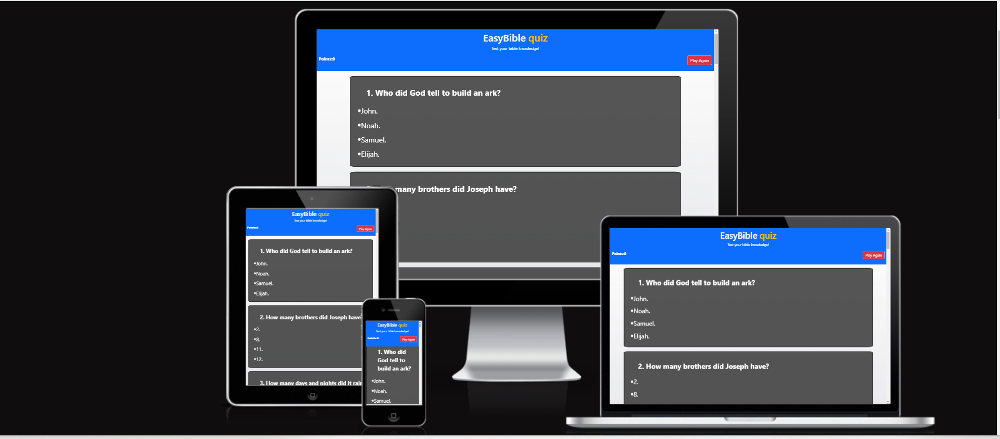

# EasyBible Quiz

Visit the deployed site: [EasyBible quiz](https://graciekan21.github.io/easybible/)

Test your bible knowledge!

As of my last knowledge update in January 2022, I don't have specific information about a particular Bible quiz web page's history. However, I can provide you with a general overview of the concept and the development of online Bible quizzes.

Online Bible quizzes have gained popularity as a way for individuals to test their knowledge of the Bible, learn more about its contents, and engage in a community of like-minded individuals. These quizzes often cover a wide range of topics, including biblical stories, characters, theology, and more.

[YouGov](https://today.yougov.com/topics/politics/explore/topic/The_Bible-Topic) show that 48% of people are round the world surveyed have heard of a Bible quiz, and are rated as the very influential.

Am inspired by various motivations,
Educational Purpose:

Promoting Bible Knowledge: A primary motivation is to encourage and facilitate the learning of the Bible. Quizzes can cover a range of topics from specific verses to general themes, helping individuals deepen their understanding of the scriptures.
Youth and Sunday School: Bible quizzes are often used as educational tools in youth groups, Sunday school classes, and other educational settings to make learning about the Bible more engaging for younger audiences.
Spiritual Growth:

Personal and Spiritual Development: Creating or participating in Bible quizzes can be a means for individuals to strengthen their faith, reflect on biblical teachings, and engage in personal spiritual growth.
Community Building:

Church Groups and Communities: Bible quizzes can serve as a fun and interactive way to bring members of a church community together. They provide a shared activity that promotes fellowship and discussion around biblical topics.
Online Ministry:

Reaching a Global Audience: With the rise of online platforms, individuals and organizations may create Bible quizzes as a way to reach a global audience, allowing people from different parts of the world to engage in discussions about the Bible, Many more.

## CONTENTS

- [EasyBible Quiz](#easybible-quiz)
  - [CONTENTS](#contents)
  - [User Experience (UX)](#user-experience-ux)
    - [User Stories](#user-stories)
      - [First Time Visito- Goals](#first-time-visito--goals)
      - [Returning Visitor- Goals](#returning-visitor--goals)
      - [Frequent Visitor- Goals](#frequent-visitor--goals)
    - [Colour Scheme](#colour-scheme)
    - [Background linear-gradien](#background-linear-gradien)
    - [Features](#features)
      - [The Home Page](#the-home-page)
      - [The 404 Error Page](#the-404-error-page)
      - [The Future for the site](#the-future-for-the-site)
    - [Accessibility](#accessibility)
  - [Technologies Used](#technologies-used)
    - [Languages Used](#languages-used)
  - [Deployment \& Local Development](#deployment--local-development)
    - [Deployment](#deployment)
    - [Local Development](#local-development)
      - [How to Fork](#how-to-fork)
      - [How to Clone](#how-to-clone)
  - [Testing](#testing)
    - [Solved Bu gs](#solved-bu-gs)
    - [Kno-n Bugs](#kno-n-bugs)
  - [Credits](#credits)
    - [Co-e Used](#co-e-used)
    - [Content](#content)
    - [Media](#media)
    - [Acknowledgments](#acknowledgments)

---

## User Experience (UX)

### User Stories

#### First Time Visito- Goals

- I want to take part in a bible quiz online to test my bible knowledge. I want to be able to do this any time, a-ywhere.
- I want the site to be responsive to my-device.
- I want the site to be easy to navigate.

#### Returning Visitor- Goals

- I want to be able to choose questions in levels from easy, hard and Hardest that thus making it more interactive and making me want to come back again.

#### Frequent Visitor- Goals

- I want to be able to add in a kids corn quiz, hard level and hardest level of question.
- I want to be able to add it social media platforms.

---

### Colour Scheme

 Am using  website

In my css file I have used variables to declare colours because it easy to make change color any time you want.

- I am using `rgb(255, 255, 255)`,`rgb(156, 158, 167)`,`#cbd2dc` & `white` colors for the background-linear-gradient image and text.
- I am using `black`,`rgba(50, 50, 50, 0.825)` for the border and questions display.
- I am using `rgb(1, 3, 3)` for the answer display.
- 1 am using `#fcf5f5` for answers when hovered over and for the `rgba(7, 10, 7, 0.3)` for answer display
- i am using `red` when answer is wrong and green when answer is correct.
  

Google Fonts am using to import the fonts for using in the site.

- For the Page Title I am using the google font [Roboto](@import url('<https://fonts.googleapis.com/css2?family=Roboto:ital>,wght@0,500;1,400&display=swap');
Roboto has a dual nature. It has a mechanical skeleton and the forms are largely geometric. At the same time, the font features friendly and open curves.

 For all the text of the web-page I am using the google fonts by Robert.

### Background linear-gradien

This web page has a background linear-gradien

### Features

This webpage is composed of a one page website which is the quiz page, it has points scored button, a pop up when the question are answered to show the scores, a play again button to erase the answers for restart; a 404 error page & a 500 error page.

This website is responsive and have:

- A favicon in the browser.

  

- The title of webpage is at the top of page.

#### The Home Page

The Easy bible quiz displays the questions on the home page and by using a cursor a user can scroll up and down the home page. The title is also displayed on top of the page and then a containers which the text questions and answers are displayed, including the play again button that when clicked it takes the user back to the home page at any time.

The user can only one attempt to select an answer per question untill done with all the questions displayed.

When the answer a user chooses one of the answers, if the answer chosen is wrong; correct-answer will show green automatically.

Am using a The pop up that alerts after completing the quiz and shows the user marks of what they have  got out of the number of questions.

#### The 404 Error Page

The 404 is a page on the shows on the webpage when the fails to load

#### The Future for the site

In future I would like to:

1. I want to add interactive and engaging elements to your Bible quiz web page can enhance the user experience.
2. Timer: Add a timer for each question to create a sense of urgency. Users can feel challenged to answer quickly, making the quiz more exciting.
3. Multimedia: Incorporate multimedia elements such as images or short audio clips related to the questions. This can make the quiz more visually appealing and engaging.
4. Randomized Questions: Shuffle the order of questions each time the quiz is taken to prevent users from memorizing the sequence.

### Accessibility

- Using  HTML.
- Using hover satetment.
- Using sans-serif bold text to ensure that they are readable even for younger users

In future i want to put into effect a tick for the correct answer anda cross for a wrong answer

---

## Technologies Used

### Languages Used

HTML, CSS, Javascript

  [Github](https://github.com/) - Using Github to store files for the web-site

  [Github](https://codeanywhere.com/) - IDE used to create the site.

- [Google Fonts](https://fonts.google.com/) - using Google fonts in the web-site.

- [JavaScript](https://) - A JavaScript
  
- [Google Developer Tools](https://developers.google.com/web/tools) - To troubleshoot and test features.

- [Favicon.io](https://favicon.io/) To create f-vicon.

- [Am I Responsive?](http://ami.responsivedesign.is/) To show the website image on a range

- [Shields.io](https://shields.io/) To add badges to the-README

- [Web Disability Simulator](https://chrome.google.com/webstore/detail/web-disability-simulator/olioanlbgbpmdlgjnnampnnlohigkjla) - a google chrome extension that allows you to view your site as people with accessibility needs would -ee it.

- [Webpage Spell-Check](https://www.grammarly.com//) - a google chrome extension that allows you to spell check your webpage. Used to check the site and the readme for spelling errs.

---

## Deployment & Local Development

### Deployment

The site is deployed using GitHub Pages - [EasyBible quiz](/https://graciekan21.github.io/easybible/).

To Deploy the site using GitHub Pages:

1. Login (or signup) to Github.
2. Go to the repository for this project, [graciekan21/EasyBible](/<https://graciekan21.github.io/easybible/).>
3. Click the settings button.
4. Select pages in the left hand navigation menu.
5. From the source dropdown select main branch and press save.
6. The site has now been deployed, please note that this process may take a few minutes before the site goes live.

### Local Development

#### How to Fork

To fork the repository:

1. Log in (or sign up) to Github.
2. Go to the repository for this project, [/](https://graciekan21.github.io/easybible/)
3. Click the Fork button in the top right corner.

#### How to Clone

To clone the repository:

1. Log in (or sign up) to GitHub.
2. Go to the repository for this project, [graciekan21/EasyBible](https://graciekan21.github.io/EasyBible)
3. Click on the code button, select whether you would like to clone with HTTPS, SSH or GitHub CLI and copy the link shown.
4. Open the terminal in your code editor and change the current working directory to the location you want to use for the cloned directory.
5. Type 'git clone' into the terminal and then paste the link you copied in step 3. Press ner.

---

## Testing

Please refer to [TESTING.md](TESTING.md) file for all testing carried out.

### Solved Bu gs

|   |                                                                                                       bug                                                                                                                                                                                                                                                                                                   Bug | How I solved t he isue                                                                                                                                                                                           I am removing it and replacing it with background-image: linear-gradient(rgb(255, 255, 255),
     rgb(156, 158, 167), as the background image. it worked.
            #cbd2dc);                                                                                                                                                                                                                                                                                                                                                                                                                                                                                                                                                                                                                  |
        1.                                                                                                                         I wanted to add a back ground image but it wasn't displaying the way i wanted it. 
                                                                                                                        I had to get remove it but and then worked with background-image: linear-gradient(rgb(255, 255, 255),
     rgb(156, 158, 167), as the background image. that worked.
            #cbd2dc);                                                                                                                                                                                                                                                                                                                                                                                                                                   |
|   2 |    The correct marks are not showing on the pop up alert after the user finishes answering all the question.                                                                                                                           I                                                                                                                                                                                                                                                                                                                                                                                                                                                            |
|   3 |                                                                                                                                                               I have the local storage set up to save the final score as mostRecentScore. However when completing a game and submitting the team name the score added to the high scores section would be the previous score and not the most rece nt score. | After a lot of research to try and find out why this was happening I went over the code again and decided to see if I changed mostRecentScore in the scoreLog to score it would make a difference. By changing this, I have solved the issue and it now pulls the most recent score a chiev ed.                                                                                                                                                                                                                                                                                                                                                                                            |
|   4 |                                                                                                                                                                                              Players were able to select an answer which would then display whether correct or incorrect. However they could still click on the answers which meant they could click all the answers to receive th e points. | I researched a way to disable the buttons and initially found that I could use answer1.disabled = true; This worked, however it added quite a bit of code, as I had to add this for each button. Further research led me to find [this article](https://blog.revillweb.com/jquery-disable-button-disabling-and-enabling-buttons-with-jquery-5e3ffe669ece) which showed how to use jQuery and the class on the buttons to enable and disable them all at the same time. This then allows me to enable the buttons when a new question has been populated and once a selection has been made, the answer buttons are disabled until the user clicks next to advance onto the next questi on. |
|   5 |                                                                                                                                                                                                                                                   There was an issue with the data-correct not always being removed correctly from questions, which meant that incorrect answers were displaying a s correct | I changed the way the data-correct attribute was removed from the answers, by using the same a for loop similar to what was used to add the data-correct attribute. I also changed the for innerText in the for loop to be innerHTML so that it was correctly reading the same as what was displayed on th e butt on.                                                                                                                                                                                                                                                                                                                                                                      |
|   6 | If a user selected an incorrect answer and the correct answer contained HTML entity characters (such as /&#(\d+);/g) the correct button styling would not be applied to the displayCorrectAnswer variable and a error would display in the console. This would then prevent the user from progressing in the quiz as the next button would not display for them to move on. | I adjusted line 161 to use innerHTML rather than innerText, however the issue persisted. I looked for an answer online but struggled to find anything that would help. I then reached out to Bim Williams on Slack who is an alumni on the course and asked to run the problem past him. He suggested adding a function that would decode the HTML entity and then apply that function within line 161. The function takes the HTML entity characters and replaces them with the correct characters. I will be researching this topic further in my spare time to gain a deeper understandi ng of it.                                                                                      |

### Kno-n Bugs

- When viewing on screens that use touch rather than a cursor, the colour change for the answer button selected is not immediately obvious as the hover state remains on the button. If the user clicks away from the button the colour can then been seen.

  

- There is a a warning displaying in the console on the live page. This error seems to be because GitHub hosted pages disable googles 3rd party cookie alternative FLoC, which then throws this error. The error doesn't affect the site in any way.

  

- When friends tested the site they found that very rarely a game will get stuck on a question, and it will not populate a new question but the question no counter continues to increase. This issue only seems to be if a large number of games are played consecutively, possibly using up the questions in the API. I have not been able to replicate this issue to troubleshoot further.
  

---

## Credits

### Co-e Used

- I used [this You Tube tutorial](https://www.youtube.com/watch?v=XH5OW46yO8I) to learn how to create a modal for the how to play s-ction.

- As the API I used for the questions declared the correct answer and then had an array of incorrect answers, I had to find a way to shuffle the answers together so that the correct answer wouldn't always appear on the same button. Research led me to the Fisher-Yates Shuffle. Other methods of shuffling can favour some items in the array more than others, however the Fisher Yates Shuffle allows for a more even spread of probability of the answer being placed on each button. I used the following [YouTube tutorial](https://www.youtube.com/watch?v=eATLMjs7y4s&list=PL5egNEXQTWmFHAoWFVRLNAvD-9zzyWVxA&index=3) to further adapt the shuffle I had researched on W3Schools to work with the data I had.

As the JavaScript modules of the Code Institute Diploma did not cover local storage, I had to do a bit of research into this topic myself in order to set up the high scores section of m- site.

- I used this [video tutorial](https://www.youtube.com/watch?v=DFhmNLKwwGw&list=PLDlWc9AfQBfZIkdVaOQXi1tizJeNJipEx&index=9) on YouTube by [James Q Quick](https://www.youtube.com/channel/UC-T8W79DN6PBnzomelvqJYw) which taught me to save the team name and score to an object, that would then be saved into an array in local storage. It also explained how to sort the items in the array into descending score order, and then to splice the array, I have used the MAX_HIGH_SCORES as my point to -plice.

- I used this [video tutorial](https://www.youtube.com/watch?v=jfOv18lCMmw&list=PLDlWc9AfQBfZIkdVaOQXi1tizJeNJipEx&index=10) on YouTube by [James Q Quick](https://www.youtube.com/channel/UC-T8W79DN6PBnzomelvqJYw) to learn how to insert the local storage into the high scores page.

### Content

All questions for my site were pulled from [The Open Trivia Database](https://opentdb.com/) using their API.

All other content for the site, such as introduction messages and instructions were written by myself.

### Media

[Page background image of a pub](https://pixabay.com/photos/bar-pub-cafe-establishment-stools-2209813/)

### Acknowledgments

I would like to acknowledge the following -eople:

- degbenga Adeye - My Code Institute -entor.

- Bim Williams - For being a great sounding board for me when I faced issues with moving onto the next question in the quiz, and for helping solve the issue faced with the HTML entity characters in the answer b-ttons.

- [Dave Horrocks](https://github.com/daveyjh) - For taking the time to walk through my code with me when I was struggling with adding event lis-eners.

- [Emanuel Silva](https://github.com/manni8436) - For cheering me on when I was struggling with the JavaScript, and for testing th- site.

- [Abi Harrison](https://github.com/Abibubble) - For being a great rubber duck and helping debug, helping to test the site and for sharing her knowledge on accessi-ility.

- The Code Institute Slack channel Peer Code Review - Thank you to everyone who took the time to play the quiz and look over the code.
