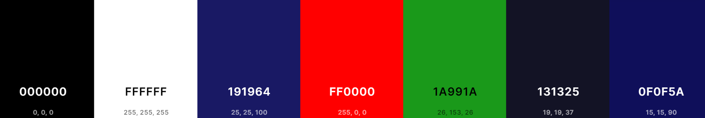

# EasyBible Quiz

Visit the deployed live site: [HERE](https://graciekan21.github.io/easybible/)

Test your bible knowledge!

As of my last knowledge update in January 2022, I don't have specific information about a particular Bible quiz web page's history. However, I can provide you with a general overview of the concept and the development of online Bible quizzes.

Online Bible quizzes have gained popularity as a way for individuals to test their knowledge of the Bible, learn more about its contents, and engage in a community of like-minded individuals. These quizzes often cover a wide range of topics, including biblical stories, characters, theology, and more.

[YouGov](https://today.yougov.com/topics/politics/explore/topic/The_Bible-Topic) show that 48% of people are round the world surveyed have heard of a Bible quiz, and are rated as the very influential.

# CONTENTS

- [EasyBible Quiz](#easybible-quiz)
- [CONTENTS](#contents)
  - [Introduction](#introduction)
  - [User Experience (UX)](#user-experience-ux)
    - [User Stories](#user-stories)
      - [First Time Visito- Goals](#first-time-visito--goals)
      - [Returning Visitor- Goals](#returning-visitor--goals)
    - [Frequent Visitor- Goals](#frequent-visitor--goals)
    - [Colour Scheme](#colour-scheme)
    - [Background linear-gradien](#background-linear-gradien)
    - [Features](#features)
      - [The Home Page](#the-home-page)
      - [The Future for the site](#the-future-for-the-site)
    - [Accessibility](#accessibility)
    - [Languages Used](#languages-used)
  - [Deployment \& Local Development](#deployment--local-development)
    - [Deployment](#deployment)
    - [Local Development](#local-development)
      - [How to Fork](#how-to-fork)
      - [How to Clone](#how-to-clone)
  - [Testing.md](#testing)
    - [Solved Bu gs](#solved-bu-gs)
    - [Kno-n Bugs](#kno-n-bugs)
  - [Credits](#credits)
    - [Code Used](#code-used)
    - [Content](#content)
    - [Media](#media)
    - [Acknowledgments](#acknowledgments)

## Introduction

- Welcome to EasyBible, your go-to destination for an engaging and educational Bible quiz experience! Whether you're a seasoned Bible scholar or just starting your journey of exploration, EasyBible is designed to test and expand your knowledge of the scriptures in a fun and interactive way.

## User Experience (UX)

### User Stories

#### First Time Visitor Goals
* I want to take part in an online Easy Bible quiz to improve my general knowledge. It should be accessible at any time and from anywhere.
* The Easy Bible website provides a broad selection of Bible knowledge quiz questions, spanning various topics similar to a Bible quiz. The site is accessible to users at their convenience.
* I expect the website to adapt seamlessly to my device's screen size and resolution.
* I have designed and developed the website with responsiveness as a priority, ensuring it adapts effectively to various screen sizes and devices. 
* I aim to make the site easy to navigate, ensuring a smooth and intuitive user experience.
* Buttons are employed for navigation across the site, resembling the style often seen in mobile applications. In line with this mobile app-like approach, I opted against incorporating a traditional navigation bar or footer, as these elements could detract from the desired aesthetic. Instead, the page title serves as a direct link to the home page, ensuring seamless navigation for users

#### Returning Visitor Goals
* Returning visitors can participate in Bible knowledge quizzes covering a wide range of topics. 
* Users are able to select their own level of difficulty before the game begins. Once they have played they are free to select a different level of difficulty for subsequent games. 

#### Frequent Visitor Goals

* Engage in Bible Knowledge Quizzes: Returning visitors can participate in Bible knowledge quizzes covering a wide range of topics. 
* Users are able to select their own level of difficulty before the game begins. Once they have played they are free to select a different level of difficulty for subsequent games.
---

### Colour Scheme

- - -

## Design

### Colour Scheme

 webpage is primarily defined within the body and .question selectors. The body selector sets the background color using a linear gradient, transitioning from darker shades of blue to black. The text color for the entire page is set to white, ensuring good contrast against the background.

Within the .question selector, the background color is set to black, providing a dark backdrop for the quiz questions. The .prompt class sets the color of the question text to white, maintaining consistency with the overall color scheme.

However, in the .answers selector, the color is explicitly set to black, which may not match the desired color scheme of the webpage. Additionally, the text-decoration property is set to white, which seems inconsistent with the typical usage of this property. It's worth reviewing and potentially adjusting these styles to ensure they align with the intended design and color scheme of the webpage.

The colors used through out the webpage 
*  `rgb 25, 25, 100,`  `rgb 15, 15, 90,`  `#131325`.
*  `rgb(0, 0, 0` .
*   ` black #000`. 
* `rgba 255, 255, 255, 1`.
* ` white`.
* `Red`.
* `Green`.

   

### Typography

Google Fonts was used to import the chosen fonts for use in the site.

* For the Page i have used [Roboto](https://fonts.google.com/specimen/Roboto?query=rob).Roboto has a dual nature. It has a mechanical skeleton and the forms are largely geometric. At the same time, the font features friendly and open curves. While some grotesks distort their letterforms to force a rigid rhythm, Roboto doesn't compromise, allowing letters to be settled into their natural width.

### Background linear-gradien

This web page has a background linear-gradien

### Features

* This webpage is a single-page website featuring the quiz. It includes a points scored bar, a pop-up displaying scores when questions are answered, and a "Play Again" button to reset the answers for a restart.
This website is responsive and have:

* A favicon is displayed in the browser tab.

 

* The webpage title is located at the top of the page.

#### The Home Page

* The Easy bible quiz displays the questions on the home page and by using a cursor a user can scroll up and down the home page. The title is also displayed on top of the page and then a containers which the text questions and answers are displayed, including the play again button that when clicked it takes the user back to the home page at any time.

* The user can only make one attempt to select an answer per question until they are done with all the questions displayed.

When the user chooses an answer, if the chosen answer is wrong, the correct answer will automatically show in green.
 

* A pop-up alert modal appears and displays the marks obtained from the quiz.

#### The Future for the site

In future I would like to:
* Timer: Implement a timer for each question to create a sense of urgency. Users will feel challenged to answer quickly, adding excitement to the quiz.
* Multimedia: Incorporate multimedia elements like images or short audio clips relevant to the questions. This can enhance the visual appeal and engagement of the quiz.
* Randomized Questions: Shuffle the order of questions each time the quiz is taken. This prevents users from memorizing the sequence, adding variety and challenge to each attempt.

### Accessibility

* Using  HTML.
* Using hover satetment.
* Using sans-serif bold text to ensure that they are readable even for younger users

In future i want to put into effect a tick for the correct answer anda cross for a wrong answer
colour blindness (red/green) correct answer.

### Languages Used

HTML, CSS, Javascript

[Github](https://github.com/) - On github is where the page files are stored

[Github](https://gitpod.com/) - IDE used to create the site.

- [Google Fonts](https://fonts.google.com/Roboto) - The Google fonts i used in the web-site.

- [JavaScript](https://) - A JavaScript

- [Favicon.io](https://favicon.io/) To create favicon.

- [Am I Responsive?](http://ami.responsivedesign.is/) To show the website image on a range

- [Webpage Spell-Check](https://www.grammarly.com//) - I used it for checking spellings while documenting my readme.

---

## Deployment & Local Development

### Deployment

The site is deployed using GitHub Pages - [EasyBible quiz](/<https://graciekan21.github.io/easybible/)

To Deploy the site using GitHub Pages:

1. Login (or signup) to Github.
2. Go to the repository for this project, [graciekan21/EasyBible](/<https://graciekan21.github.io/easybible/)
3. Click the settings button.
4. Select pages in the left hand navigation menu.
5. From the source dropdown select main branch and press save.
6. The site has now been deployed, please note that this process may take a few minutes before the site goes live.

### Local Development

#### How to Fork

To fork the repository:

1. Log in (or sign up) to Github.
2. Go to the repository for this project, [Fork](https://graciekan21.github.io/easybible/)
3. Click the Fork button in the top right corner.

#### How to Clone

To clone the repository:

1. Log in (or sign up) to GitHub.
2. Go to the repository for this project, [graciekan21/EasyBible](https://graciekan21-easybible-yds9nhpxjwr.ws-eu108.gitpod.io/)
3. Click on the code button, select whether you would like to clone with HTTPS, SSH or GitHub CLI and copy the link shown.
4. Open the terminal in your code editor and change the current working directory to the location you want to use for the cloned directory.
5. Type 'git clone' into the terminal and then paste the link you copied in step 3. Press ner.

---

## Testing

all are validated through w3 validator

[Css validator](https://jigsaw.w3.org/css-validator/validator)

### Solved Bu gs
| No | Bug | How I solved the issue |
| :--- | :--- | :--- |
| 1 | The background image is not displaying as expected.| To address the issue of adding a background image on the webpage, which wasn't displaying as desired, I resolved it by removing the background image completely and replacing it with a linear gradient using the background-image: linear-gradient property with the specified RGB values.| 
| 2 | The pop-up alert was not displaying the marks as expected.| The issue of correct marks not displaying on the   pop-up alert after the user finishes answering all the questions was addressed by adjusting the JavaScript logic. I corrected it by ensuring that for every repeated increment, the total score is divided by 4. Additionally, I modified the condition to display the correct marks at the end of the quiz to (total_attempts / 4 >= total_questions). This adjustment ensured that the correct marks are accurately calculated and displayed in the pop-up alert.|
| 3 | I made some changes directly to my repository without committing them, and then I made additional changes to the README file in my IDE. However, I encountered an issue when trying to push these changes to the repository. With the help of tutor support, I resolved the issue by using git pull and git rebase to incorporate the changes from the remote repository into my local branch. After resolving any conflicts, I was able to commit the files to the main branch successfully.|

### Kno-n Bugs

---

## Credits

### Code Used

* By using [W3 schools](https://cdn.jsdelivr.net/npm/bootstrap@5.3.2/dist/css/bootstrap.min.css) 

Bootstrap is a great tool to work with.

* By using [sweet alert](https://sweetalert.js.org/guides/) which i used to achieve the pop up alert at the end of the quiz.

* [YouTube tutorial](https://www.youtube.com/watch?v=4sosXZsdy-s&t=615s&ab_channel=TraversyMedia) helped me understand Bootstrap and how to use it for my webpage.

### Content

For all the questions and correct answers i used [parde.com](https://parade.com/1048764/marynliles/bible-trivia-questions/)

For the remaining content of the webpage, such as the title, headings, and instructions, I wrote them myself.

### Media

[Favicon](https://icons8.com/icons/set/favicon)

### Acknowledgments

I would like to Acknowledge

* [Fredrick Sanhewe] I would like to express my heartfelt gratitude to for helping me when i was struggling with Javascript and debuging. Their expertise, dedication, and collaborative spirit significantly. I am truly grateful for their support.

* [Jubril Akolade](https://learn.codeinstitute.net/ci_support/diplomainfullstacksoftwarecommoncurriculum/mentor)- I extend my deepest gratitude and unwavering guidance and mentorship throughout this project. Helped me throuh the readme.Thank you for being an inspiring mentor and a driving force behind our achievements.

* [Tutor Support](https://learn.codeinstitute.net/ci_support/diplomainfullstacksoftwarecommoncurriculum/tutor)
  A huge shout-out to our amazing tutors for their invaluable support in debugging challenges. Your expertise and patient guidance have been instrumental in overcoming obstacles and enhancing our understanding. Thank you for being the troubleshooters behind our success!
